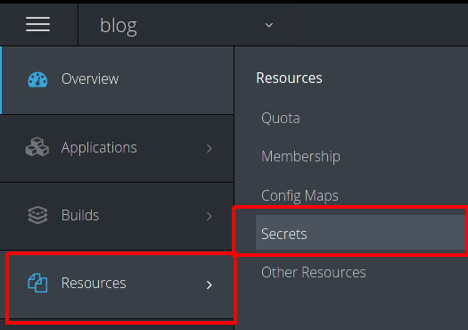
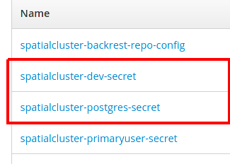

# Cloud Native Spatial with PostGIS
## Getting pg_featureserv and pg_tileserv up and running on Kubernetes

You probably already read about [pg_featureserv]() and [pg_tileserv]() along with their intended place in the [spatial ecosystem]()  (if you haven’t, go read those links now - we’ll wait for you). You have also heard about containers and Kubernetes - you may even be evaluating or running it. Well today’s piece is going to show you how simple and easy it is to run these new spatial servers alongside PostGIS in your cloud native architecture. Along the way we will point out some of the ways in which these projects fit so nicely into your cloud native or microservices architecture.


## Assumptions/Prerequisites

Before we get started I assume you already 
1. Have a Kuberentes or OpenShift (remember OpenShift is Red Hat's distributions of Kubernetes) cluster up and running. It should be greater than Kubernetes 1.13 and OpenShift 3.11. 
1. You should also have the Crunchy Postgres Operator (hereafter referred to as *operator*) installed in your Kube or OpenShift cluster and ready to deploy a PostGIS cluster. 
1. You have the pgo client utility on your local machine and set up to talk to your cluster
1. We assume you understand [Kubernetes]() and [OpenShift]() concepts, so if you see one here that you don’t understand you will know how to find more information. 
1. We also assume you know how to use PostGIS, especially importing data.

For this blog post we are going to use OpenShift because it has a nicer interface and user experience for working with Kubernetes Objects. We installed the Crunchy Operator in a namespace called **pgo** and we are going to put all our work in a namespace named **blog**. We will create the **blog** namespace with the Crunchy operator.

## Provisioning Your Database

So let’s get started by provisioning our database. The first step is going to be getting `pgo` client tool, used to interact with the Crunchy Operator, talking to the API container in the operator pod

Since we are using OpenShift we are going to use the `oc` command line tool to get our `pgo` connection working. Make sure your `oc` client is authenticated to your cluster and then away we go

``` 
$ oc project pgo
    Now using project "pgo" on server "https://openshift-pousty-ocp.gce-containers.crunchydata.com:443".
$ oc get pods
    NAME                                 READY     STATUS    RESTARTS   AGE
    postgres-operator-5fb47ccf59-46wcf   4/4       Running   20         50d
$ oc port-forward postgres-operator-5fb47ccf59-46wcf 8443:8443
    Forwarding from 127.0.0.1:8443 -> 8443
    Forwarding from [::1]:8443 -> 8443

```
We told the OpenShift client to
1. Use the namespace pgo, where we had installed the Crunchy PostgreSQL Operator
2. Give us the pods in the namespace of which is there is only the API server/operator
3, Port-forward port 8443 on our local machine to port 8443 in the running pod. This will allow us to send `pgo` commands from our local machine

Now let's make our PostGIS database cluster!

```   
$ pgo create namespace blog
$ export PGO_NAMESPACE=blog
# In windows command shell you would do:
#    set PGO_NAMESPACE="blog"   
# In windows powershell
#    $env:PGO_NAMESPACE="blog"
$ pgo create cluster spatialcluster --ccp-image=crunchy-postgres-gis-ha

```    

And with that we have:
 1. Create a new namespace/project in our OpenShift instance
 1. Told the PGO command line to do everything in that new namespace. We did not have to do this (you can always add a `-n blog` onto any `pgo` command)
 1. Created a nice PostGIS cluster with a database named demodb. 
 
 You can load any spatial data in the normal way you load into this new database. I loaded some data from the [Crunchy Demo Data](https://github.com/CrunchyData/crunchy-demo-data/) repository. To be more precise, I downloaded the [latest release](https://github.com/CrunchyData/crunchy-demo-data/releases/tag/v0.4) and loaded the county boundaries and storm data. 
 
 You will see in the release notes for the data above we are using the psql command line. You might be wondering how we found out the username and password to use. Well when we created the PostgreSQL cluster using the Operator, it created some [Secrets](https://kubernetes.io/docs/concepts/configuration/secret/).
 
 To see all the secrets made by the operator, in the OpenShift Web UI:
 
 
 
 Once you click on secrets you will see all the secrets in the namespace/project. The ones we are interested in all begin with the name we use for our PostgreSQL cluster (which in our case is 'spatialcluster') The two we really care about are the ones with postgres and dev in the name:
 
  
 
 These correspond to the postgres (superuser) user and the normal unprivileged user (named dev).
 
 To actually see the password that correspond to that user go ahead and click on the secret. And then click on the 'reveal secret' link to see the unencoded password.
 
 
 
 ## Let's get spatial!
 
 Now that we have our data loaded into PostGIS it's time to get the spatial app servers into Kubernetes/OpenShift. Given that these pieces were built to be cloud native you will see how easy it is to run them in a cloud platform. After that we'll scale them up with ease.
 
 ### Starting with pg_featureserv
 
 Luckily for us OpenShift has a nice command for adding containers to run in Kubernetes. We can do a simple command and load our container into kubernetes with very reasonable defaults for running. So with that let's get going. Here is the command to load the container from Docker hub or the Crunchy container repo.  TODO  FILL THIS IN WITH BOTH REPOS


