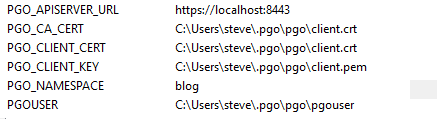

# Setting up and running the Crunchy PostgreSQL Operator client (pgo) on Windows

Today's blog post is for all those people who want to create and manage PostgreSQL or PostGIS clusters AFTER the Crunchy PostgreSQL Operator (Operator) has been installed on their Kubernetes/OpenShift cluster. If you need more information on the Operator we have a great [blog post](https://info.crunchydata.com/blog/postgres-operator-for-kubernetes) for you and another on [latest updates](https://info.crunchydata.com/blog/crunchy-postgres-kubernetes-operator-4.0). 

## Introduction

As a developer, DBA, or data scientist with your company to moving to a Kubernetes infrastructure, having access to Operator can make your life a LOT easier. There are plenty of instances where you don't want to be responsible for installing the Operator but you want to have the ability to:

1. Spin up a new PostgreSQL cluster
1. Add or remove replicas from the cluster
1. Do a backup of the cluster
1. Add PGBouncer to the architecture 

Installing the Operator requires much higher permission levels to the cluster and the installation of more complex software on your machine. Because the Operator command line `pgo` is written in Go, we compile native binaries for Windows, Mac, and Linux meaning it is really easy to run. So let's go ahead and get you going!

## Assumptions and prerequisites

Before we get started, make sure you have access to a Kubernetes or OpenShift cluster where the operator is installed. If you want to add PostgreSQL clusters to namespaces/projects not specified during installation then during the installation, the admin needs to enable 'dynamic namespaces'.

The admin has also sent you the version number of the Operator installed on the cluster.

The Kubernetes administrator has to grant you `get, list, create` permissions for `pods/port-forward` to the namespace where they installed the operator. That namespace will be `pgo` by default. Here is a [Stack Overflow post](https://stackoverflow.com/questions/56670876/how-can-i-allow-port-forwarding-for-a-specific-deployment-in-kubernetes) that shows an example of the RBAC needed to enable this. Look at the code snippet in the question, we don't need the answers because we don't need the specifics of the questioner
   
Finally, the admin who carried out the Operator install needs to send you the `.pgo` directory created on their local machine during installation. This is typically created in the home directory of the user doing the creation. This directory contains the certificates and user information needed to securely connect to the operator.


## Steps to getting it all going

### Setting up the binary
The first step is getting the pgo client binaries on our machine. If you are currently a Crunchy Data customer you can go to the access portal and get packing for the client that matches your platform. If you are not a customer, you can obtain the binary on GitHub from the Operator [releases page](https://github.com/CrunchyData/postgres-operator/releases). The pgo file is for Linux, the pgo-mac is for Mac, and pgo.exe is for Windows. Today I am working on a windows machine so I will grab the pgo.exe.  Be sure to download the release that matches your Operator version.

Once you have downloaded the binary we recommend putting it in a directory in your path or add the directory your path. By doing this it becomes easy to call the client from the command line. In my case I have a home directory titled `bin` and I added it to my path. Here are some nice [little docs](https://docs.alfresco.com/4.2/tasks/fot-addpath.html) on how to [add a directory](https://www.poftut.com/how-to-set-java-jre-and-jdk-home-path-and-environment-variables-on-windows/) to your path on Windows.  

### .pgo directory and Environment Variables

That .pgo directory you admin sent you needs to be placed in your home directory. As stated above, this will give you all the certificates and auxiliary files you need to talk to the Operators.

With that done we need to set up a few environment variables for the command line tool. We could skip doing this step but it would mean having to pass in some long flags to our commands on every call.  If you don't know how to set environment variables on Windows, the StackExchange Community SuperUser has a nice post on Environment Variables and how to set [them on Windows](https://superuser.com/questions/284342/what-are-path-and-other-environment-variables-and-how-can-i-set-or-use-them). 

Here are the variables we are going to set and their values:

| Name   | Value |
| ---    | --- |
| PGO_CA_CERT | %USERPROFILE%\.pgo\pgo\client.crt |
| PGO_CLIENT_CERT |%USERPROFILE%\.pgo\pgo\client.crt |
| PGO_CLIENT_KEY | %USERPROFILE%\.pgo\pgo\client.pem |
| PGO_APISERVER_URL | https://localhost:8443 |
| PGO_NAMESPACE | *your_project_namespace* |
| PGOUSER | %USERPROFILE%\.pgo\pgo\pgouser |

In the end your environment variable section should have entries like this:



Remember these new environment variables will not show up until you open a new Command Prompt or Powershell session. 

If you put the *.pgo* directory from your admin into your home directory then you can use the values exactly as shown above, otherwise you need to set the paths to point to the location where you placed the .pgo directory.

The value of PGO_NAMESPACE should be set to a string that is the same as the Kubernetes namespace or OpenShift project where you want to create your PostgreSQL clusters. 

We set the API Server URL to localhost because we will be using port-forwarding to talk to your Kubernetes cluster.  

## Connecting to the Operator pod in Kubernetes

Now is the time to port-forward to the Operator in Kubernetes. I will be using PowerShell but use whichever you prefer. Please make sure you have authenticated your kubectl or oc command line client. 

For all the Kubernetes/OpenShift commands (as opposed to Operator commands) there is no difference in command syntax, just a different binary to call - *oc* versus *kubectl*. I will use *kubectl* in this blog post.
 
I would also recommend you set *pgo* to be your default namespace/project but I will use the flags here. 

### Port-Forward to the Operator service

We are going to set it up so that when we request port 8443 from localhost, the request will actually be forwarded to port 8443 on the Operator service. The service will then forward on our  The command is really quite simple:

```
> kubectl -n pgo port-forward svc/postgres-operator 8443:8443
  
Forwarding from 127.0.0.1:8443 -> 8443
Forwarding from [::1]:8443 -> 8443
```

If you already have something running on your location machine on port 8443 you can use a different localhost port, like 8553. Just remember to change your PGO_APISERVER_URL environment variable to reflect your new port.

```
> kubectl -n pgo port-forward svc/postgres-operator 8443:8553
Forwarding from 127.0.0.1:8443 -> 8553
Forwarding from [::1]:8443 -> 8553
```

## Testing your connection
 
 Well now let's make sure it all works. All we have to do is get our pgo command line tool to connect to the Operator pod. 
 Since our original terminal is blocked while it does the port-forward we need to open a new terminal and do the following command:
 
 ```
> pgo version
pgo client version 4.2.1
pgo-apiserver version 4.2.1
```

Here we can see that the API Server in the Operator pod returned it's version, insuring we can talk to the Operator to do all our other commands.

If you want to do one more check you can do another command to see the configuration of the Operator:

```
> pgo show config
BasicAuth: ""
Cluster:
  CCPImagePrefix: crunchydata
  CCPImageTag: centos7-12.1-4.2.1
  PrimaryNodeLabel: ""
  ReplicaNodeLabel: ""
  Policies: ""
  LogStatement: none
  LogMinDurationStatement: "60000"
  Metrics: false
  Badger: false
  Port: "5432"
...
```

## Wrap and further actions

In today's post we showed you how to prepare your Windows computer to talk to the Crunchy PostgreSQL Operator for Kubernetes. We covered 
* Making sure the proper settings are on your Kubernetes/OpenShift cluster
* Getting the proper files and information from the person who installed the Operator on the cluster
* Downloading the Windows command line client for the Operator
* Setting up the environment variables on your machine
* Port-forwarding to the Operator running in your Kubernetes cluster
* Issuing commands to make sure the connection is working.

Now, the world is your oyster (at least when it comes to highly redundant, simple to use PostgreSQL or PostGIS running in Kubernetes)! You can now look at the [command line documentation](https://access.crunchydata.com/documentation/postgres-operator/4.2.2/pgo-client/) to try out all the fun commands.

Have fun with all your shiny new PostgreSQL goodness and keep it cloudy. 