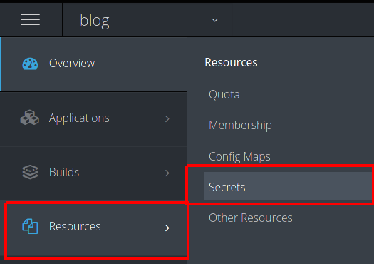
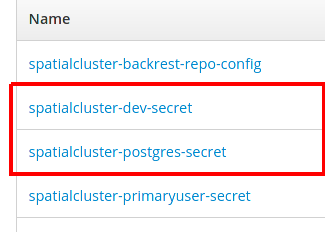
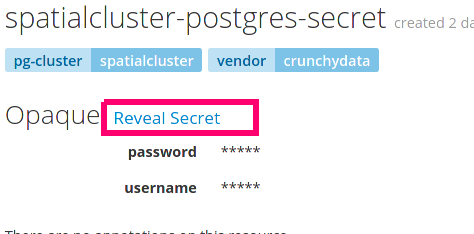

## Introduction

In today's blog post I am going to show you how to easily spin up PostGIS in your Kubernetes or OpenShift cluster using the [Crunchy PostgreSQL Operator](https://access.crunchydata.com/documentation/postgres-operator/latest/). You or your company may have started to investigate how to take advantage of all the Kubernetes goodness, especially combining it with your favorite spatial database, PostGIS. Well have no fear, after a few introductory steps I will show you how one command can bring up PostGIS and then with another command make it a replicated cluster. This replicated cluster will be able to handle automatic failover and backup tasks with ease. Let's get going! 

## Assumptions/Prerequisites

Before we get started I assume you already 
1. Have a Kuberentes or OpenShift (remember OpenShift is Red Hat's distributions of Kubernetes) cluster up and running. It should be greater than Kubernetes 1.13 and OpenShift 3.11. 
1. You should also have the Crunchy Postgres Operator (hereafter referred to as *operator*) installed in your Kube or OpenShift cluster and ready to deploy a PostGIS cluster. 
1. You have the pgo client utility on your local machine and set up to talk to your cluster
1. You have read [the documentation](https://access.crunchydata.com/documentation/postgres-operator/4.2.2/installation/install-pgo-client/) (for Windows, Mac, and Linux) or this [blog post]() (for Windows) on how to connect the `pgo` client to the Operator
1. We assume you understand [Kubernetes](https://kubernetes.io/docs/concepts/) and [OpenShift](https://docs.openshift.com/container-platform/4.3/welcome/index.html) concepts, so if you see one here that you don’t understand you will know how to find more information. 
1. We also assume you know how to use PostGIS, especially importing data.

For this blog post we are going to use OpenShift because it has a nicer interface and user experience for working with Kubernetes Objects. We installed the Crunchy Operator in a namespace called **pgo** and we are going to put all our work in a namespace named **blog**. We will create the **blog** namespace with the Crunchy operator.

## Provisioning Your Database

So let’s get started by provisioning our database. The first step is going to be getting `pgo` client tool, used to interact with the Crunchy Operator, talking to the API container in the operator pod

Since we are using OpenShift we are going to use the `oc` command line tool to get our `pgo` connection working. The `kubectl` command have the exact same syntax. 

Make sure your `oc` client is authenticated to your cluster and then away we go

``` 
$ oc project pgo
    Now using project "pgo" on server "https://openshift-pousty-ocp.gce-containers.crunchydata.com:443".
$ oc get pods
    NAME                                 READY     STATUS    RESTARTS   AGE
    postgres-operator-5fb47ccf59-46wcf   4/4       Running   20         50d
$ oc port-forward postgres-operator-5fb47ccf59-46wcf 8443:8443
    Forwarding from 127.0.0.1:8443 -> 8443
    Forwarding from [::1]:8443 -> 8443

```
We told the OpenShift client to
1. Use the namespace pgo, where we had installed the Crunchy PostgreSQL Operator
2. Give us the pods in the namespace of which is there is only the API server/operator
3, Port-forward port 8443 on our local machine to port 8443 in the running pod. This will allow us to send `pgo` commands from our local machine

Now let's make our PostGIS database cluster!

```   
$ pgo create namespace blog
$ export PGO_NAMESPACE=blog
# In windows command shell you would do:
#    set PGO_NAMESPACE="blog"   
# In windows powershell
#    $env:PGO_NAMESPACE="blog"
$ pgo create cluster spatialcluster --ccp-image=crunchy-postgres-gis-ha

```    
Congratulations - with one line you have just spun up a PostGIS cluster inside your Kubernetes cluster. It is using PVCs for data storage, has the PostGIS extension already enabled, and you can use the Crunchy PostgreSQL Operator to manage all types of [administrative tasks](https://access.crunchydata.com/documentation/postgres-operator/4.2.2/pgo-client/common-tasks/). 

Here is what the actual commands accomplished:
 1. Create a new namespace/project in our OpenShift instance. TEST TO SEE WHAT HAPPENS IF IT ALREADY EXISTS
 1. Told the PGO command line to do everything in that new namespace. We did not have to do this (you can always add a `-n blog` onto any `pgo` command)
 1. Created a nice PostGIS cluster with a database named demodb. 
 
 We can now load any spatial data in the normal way you load into this new database. There are two ways to achieve this and it depends on how we receive our data. The first method will be the most general and will assume you have all the import tools you need on your local machine. The other method will transfer the data up to a directory in the pod running in the Kube cluster and then do the import all in the pod. 
 
 ### Importing data from the local machine
 I am going to  load some data from the [Crunchy Demo Data](https://github.com/CrunchyData/crunchy-demo-data/) repository. To be more precise, I downloaded the [latest release](https://github.com/CrunchyData/crunchy-demo-data/releases/tag/v0.4) and loaded the county boundaries and storm data. 
 
 You will see in the release notes for the data above we are using the psql command line. You might be wondering how we found out the username and password to use. Well when we created the PostgreSQL cluster using the Operator, it created some [Secrets](https://kubernetes.io/docs/concepts/configuration/secret/).
 
 To see all the secrets made by the operator, in the OpenShift Web UI:
 
 
 
 Once you click on secrets you will see all the secrets in the namespace/project. The ones we are interested in all begin with the name we use for our PostgreSQL cluster (which in our case is 'spatialcluster') The two we really care about are the ones with postgres and dev in the name:
 
  
 
 These correspond to the postgres (superuser) user and the normal unprivileged user (named dev).
 
 To actually see the password that correspond to that user go ahead and click on the secret. And then click on the 'reveal secret' link to see the unencoded password.
 
 
 
 
 
 ### Importing Data on the pod
 
 
 ## Adding Replicas to our cluster
 
 Now that we have imported data into our cluster, let's go ahead and add some read replicas. For large data sets, adding replicas after adding the data is the preferred pattern. The reason this is preferred is because importing the data creates large Write Ahead Log entry files (WAL) that will have to be retained until the replicas catch up. If you have not allocated quite a bit more extra disk space it can be easy to exhaust your disks and lock up PostgreSQL. 
 
   